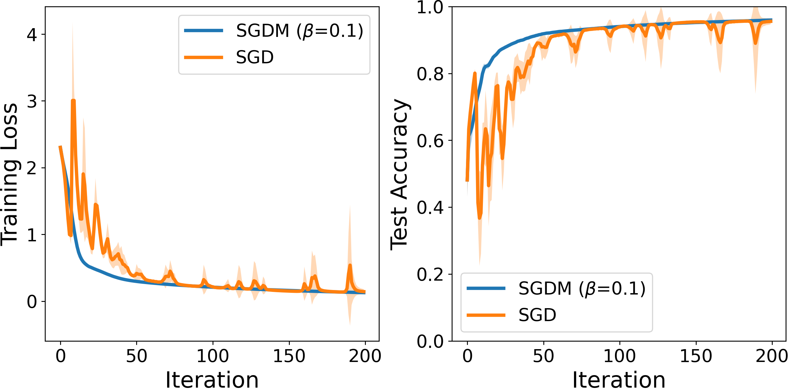
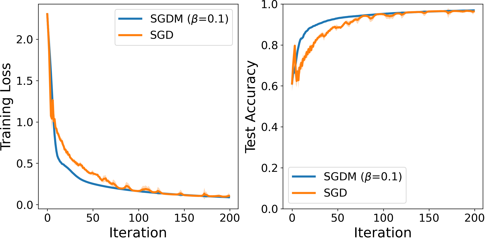
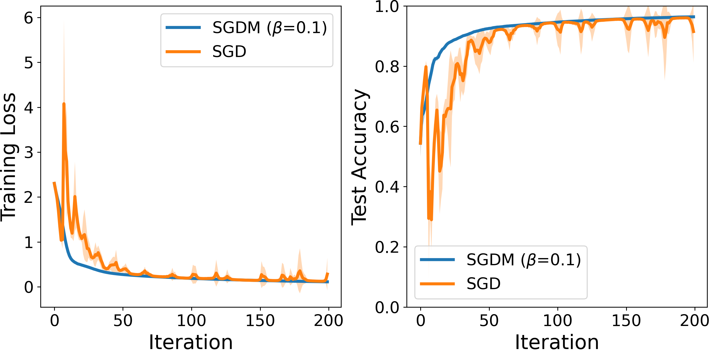
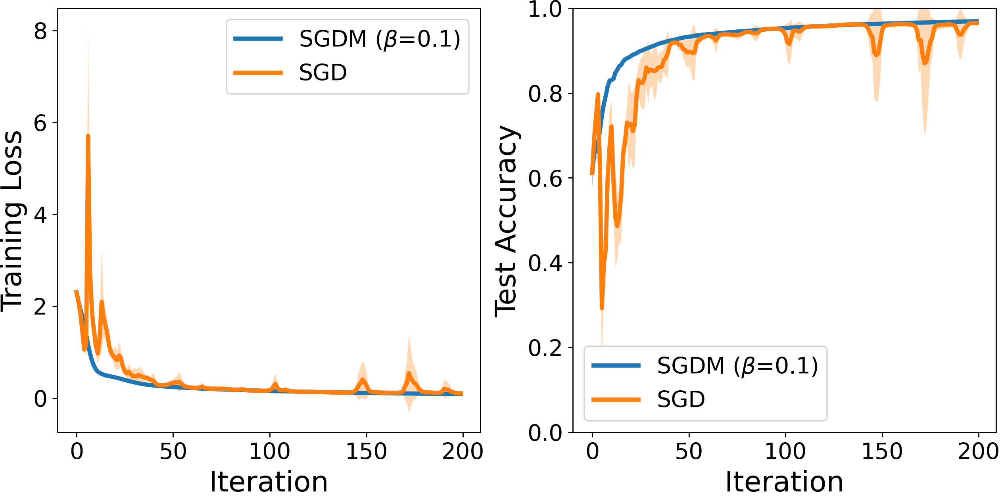

# DistributedSGDM
Implementation of **DistributedSGDM**, as presented in:
* Distributed Momentum Methods Under Biased Gradients Estimation. Submitted to the IEEE Transactions on Neural Networks and Learning Systems.


# Additional Numerical Evaluations on Deep Neural Networks
Additional learning curves are included here. To be more specific, Figures \ref{fig3} and  \ref{fig4}  contain learning curves for the MNIST dataset using FCNN. Also, for the FashionMNIST dataset, more results are shown in Figures \ref{fig5}, \ref{fig6}, \ref{fig7}, \ref{fig8}, \ref{fig9}, and  \ref{fig10}, utilizing ResNet-18 model. The shaded regions correspond to the standard deviation of the average evaluation over five trials.

* Results on MNIST dataset, considering $n=100$ and $\gamma=0.5$ - FCNN.

  
  * Top-5\% sparsification
    <p>
    
    </p>
    
  * Clipped with $\tau=1$
    
    
  * Top-10\% sparsification
    
    
  * Clipped with $\tau=5$
    
    


  * Top-5\% sparsification
    
    
  * Clipped with $\tau=1$
    
    
  * Top-10\% sparsification
    
    
  * Clipped with $\tau=5$
    
    


\begin{figure*}[ht] %[h]
     \centering
     \subfloat[Top-5\% sparsification]{
         \includegraphics[width=0.49\linewidth]{MNIST_WOT/MNIST_A_512512_penalty_0.0_e_200_N_100_SGDM_lr_0.5_beta_0.1_TopK_33500.png}
         \label{fig3a}}
     \subfloat[Clipped with $\tau=1$]{
         \includegraphics[width=0.49\linewidth]{MNIST_WOT/MNIST_A_512512_penalty_0.0_e_200_N_100_SGDM_lr_0.5_beta_0.1_ClipNorm_1.0.png}
         \label{fig3b}}
     \hfill   
     \subfloat[Top-10\% sparsification]{
        \includegraphics[width=0.49\linewidth]{MNIST_WOT/MNIST_A_512512_penalty_0.0_e_200_N_100_SGDM_lr_0.5_beta_0.1_TopK_67000.png}
         \label{fig3c}}
     \subfloat[Clipped with $\tau=5$]{
         \includegraphics[width=0.49\linewidth]{MNIST_WOT/MNIST_A_512512_penalty_0.0_e_200_N_100_SGDM_lr_0.5_beta_0.1_ClipNorm_5.0.png}
         \label{fig3d}}
        \caption{Results on MNIST dataset, considering $n=100$ and $\gamma=0.5$ - FCNN. }
        \label{fig3}
\end{figure*}

\begin{figure*}[ht] %[h]
     \centering
     \subfloat[Top-1\% sparsification]{
         \includegraphics[width=0.49\linewidth]{MNIST_WOT/MNIST_A_512512_penalty_0.0_e_200_N_100_SGDM_lr_0.7_beta_0.1_TopK_13400.png}
         \label{fig4a}}
     \subfloat[Clipped with $\tau=1$]{
         \includegraphics[width=0.49\linewidth]{MNIST_WOT/MNIST_A_512512_penalty_0.0_e_200_N_100_SGDM_lr_0.7_beta_0.1_ClipNorm_1.0.png}
         \label{fig4b}}
     \hfill   
     \subfloat[Top-5\% sparsification]{
        \includegraphics[width=0.49\linewidth]{MNIST_WOT/MNIST_A_512512_penalty_0.0_e_200_N_100_SGDM_lr_0.7_beta_0.1_TopK_33500.png}
         \label{fig4c}}
     \subfloat[Clipped with $\tau=2$]{
         \includegraphics[width=0.49\linewidth]{MNIST_WOT/MNIST_A_512512_penalty_0.0_e_200_N_100_SGDM_lr_0.7_beta_0.1_ClipNorm_2.0.png}
         \label{fig4d}}
    \hfill   
     \subfloat[Top-10\% sparsification]{
        \includegraphics[width=0.49\linewidth]{MNIST_WOT/MNIST_A_512512_penalty_0.0_e_200_N_100_SGDM_lr_0.7_beta_0.1_TopK_67000.png}
         \label{fig4e}}
     \subfloat[Clipped with $\tau=5$]{
         \includegraphics[width=0.49\linewidth]{MNIST_WOT/MNIST_A_512512_penalty_0.0_e_200_N_100_SGDM_lr_0.7_beta_0.1_ClipNorm_5.0.png}
         \label{fig4f}}
        \caption{Results on MNIST dataset, considering $n=100$ and $\gamma=0.7$ - FCNN.}
        \label{fig4}
\end{figure*}


\begin{figure*}[ht] %[h]
     \centering
     \subfloat[Top-0.1\% sparsification]{
         \includegraphics[width=0.49\linewidth]{FMNIST_WOT/FashionMNIST_A_ResNet18_penalty_0.0_e_300_N_100_SGDM_lr_0.3_beta_0.1_TopK_11181.png}
         \label{fig5a}}
     \subfloat[Clipped with $\tau=1$]{
         \includegraphics[width=0.49\linewidth]{FMNIST_WOT/FashionMNIST_A_ResNet18_penalty_0.0_e_300_N_100_SGDM_lr_0.3_beta_0.1_ClipNorm_1.0.png}
         \label{fig5b}}
     \hfill   
     \subfloat[Top-1\% sparsification]{
        \includegraphics[width=0.49\linewidth]{FMNIST_WOT/FashionMNIST_A_ResNet18_penalty_0.0_e_300_N_100_SGDM_lr_0.3_beta_0.1_TopK_111816.png}
         \label{fig5c}}
     \subfloat[Clipped with $\tau=2$]{
         \includegraphics[width=0.49\linewidth]{FMNIST_WOT/FashionMNIST_A_ResNet18_penalty_0.0_e_300_N_100_SGDM_lr_0.3_beta_0.1_ClipNorm_2.0.png}
         \label{fig5d}}
    \hfill   
     \subfloat[Top-10\% sparsification]{
        \includegraphics[width=0.49\linewidth]{FMNIST_WOT/FashionMNIST_A_ResNet18_penalty_0.0_e_300_N_100_SGDM_lr_0.3_beta_0.1_TopK_1118164.png}
         \label{fig5e}}
     \subfloat[Clipped with $\tau=5$]{
         \includegraphics[width=0.49\linewidth]{FMNIST_WOT/FashionMNIST_A_ResNet18_penalty_0.0_e_300_N_100_SGDM_lr_0.3_beta_0.1_ClipNorm_5.0.png}
         \label{fig5f}}
        \caption{Results on FashionMNIST dataset, considering $n=100$ and $\gamma=0.3$ - ResNet-18.}
        \label{fig5}
\end{figure*}


\begin{figure*}[ht] %[h]
     \centering
     \subfloat[Top-0.1\% sparsification]{
         \includegraphics[width=0.49\linewidth]{FMNIST_WOT/FashionMNIST_A_ResNet18_penalty_0.0_e_300_N_100_SGDM_lr_0.3_beta_0.3_TopK_11181.png}
         \label{fig6a}}
     \subfloat[Clipped with $\tau=1$]{
         \includegraphics[width=0.49\linewidth]{FMNIST_WOT/FashionMNIST_A_ResNet18_penalty_0.0_e_300_N_100_SGDM_lr_0.3_beta_0.3_ClipNorm_1.0.png}
         \label{fig6b}}
     \hfill   
     \subfloat[Top-1\% sparsification]{
        \includegraphics[width=0.49\linewidth]{FMNIST_WOT/FashionMNIST_A_ResNet18_penalty_0.0_e_300_N_100_SGDM_lr_0.3_beta_0.3_TopK_111816.png}
         \label{fig6c}}
     \subfloat[Clipped with $\tau=2$]{
         \includegraphics[width=0.49\linewidth]{FMNIST_WOT/FashionMNIST_A_ResNet18_penalty_0.0_e_300_N_100_SGDM_lr_0.3_beta_0.3_ClipNorm_2.0.png}
         \label{fig6d}}
    \hfill   
     \subfloat[Top-10\% sparsification]{
        \includegraphics[width=0.49\linewidth]{FMNIST_WOT/FashionMNIST_A_ResNet18_penalty_0.0_e_300_N_100_SGDM_lr_0.3_beta_0.3_TopK_1118164.png}
         \label{fig6e}}
     \subfloat[Clipped with $\tau=5$]{
         \includegraphics[width=0.49\linewidth]{FMNIST_WOT/FashionMNIST_A_ResNet18_penalty_0.0_e_300_N_100_SGDM_lr_0.3_beta_0.3_ClipNorm_5.0.png}
         \label{fig6f}}
        \caption{Results on FashionMNIST dataset, considering $n=100$ and $\gamma=0.3$ - ResNet-18.}
        \label{fig6}
\end{figure*}


\begin{figure*}[ht] %[h]
     \centering
     \subfloat[Top-1\% sparsification]{
         \includegraphics[width=0.49\linewidth]{FMNIST_WOT/FashionMNIST_A_ResNet18_penalty_0.0_e_300_N_100_SGDM_lr_0.5_beta_0.1_TopK_111816.png}
         \label{fig7a}}
     \subfloat[Clipped with $\tau=1$]{
         \includegraphics[width=0.49\linewidth]{FMNIST_WOT/FashionMNIST_A_ResNet18_penalty_0.0_e_300_N_100_SGDM_lr_0.5_beta_0.1_ClipNorm_1.0.png}
         \label{fig7b}}
     \hfill   
     \subfloat[Top-10\% sparsification]{
        \includegraphics[width=0.49\linewidth]{FMNIST_WOT/FashionMNIST_A_ResNet18_penalty_0.0_e_300_N_100_SGDM_lr_0.5_beta_0.1_TopK_1118164.png}
         \label{fig7c}}
     \subfloat[Clipped with $\tau=5$]{
         \includegraphics[width=0.49\linewidth]{FMNIST_WOT/FashionMNIST_A_ResNet18_penalty_0.0_e_300_N_100_SGDM_lr_0.5_beta_0.1_ClipNorm_5.0.png}
         \label{fig7d}}
        \caption{Results on FashionMNIST dataset, considering $n=100$ and $\gamma=0.5$ - ResNet-18.}
        \label{fig7}
\end{figure*}


\begin{figure*}[ht] %[h]
     \centering
     \subfloat[Top-0.1\% sparsification]{
         \includegraphics[width=0.49\linewidth]{FMNIST_WOT/FashionMNIST_A_ResNet18_penalty_0.0_e_300_N_100_SGDM_lr_0.5_beta_0.3_TopK_11181.png}
         \label{fig8a}}
     \subfloat[Clipped with $\tau=1$]{
         \includegraphics[width=0.49\linewidth]{FMNIST_WOT/FashionMNIST_A_ResNet18_penalty_0.0_e_300_N_100_SGDM_lr_0.5_beta_0.3_ClipNorm_1.0.png}
         \label{fig8b}}
     \hfill   
     \subfloat[Top-1\% sparsification]{
        \includegraphics[width=0.49\linewidth]{FMNIST_WOT/FashionMNIST_A_ResNet18_penalty_0.0_e_300_N_100_SGDM_lr_0.5_beta_0.3_TopK_111816.png}
         \label{fig8c}}
     \subfloat[Clipped with $\tau=2$]{
         \includegraphics[width=0.49\linewidth]{FMNIST_WOT/FashionMNIST_A_ResNet18_penalty_0.0_e_300_N_100_SGDM_lr_0.5_beta_0.3_ClipNorm_2.0.png}
         \label{fig8d}}
    \hfill   
     \subfloat[Top-10\% sparsification]{
        \includegraphics[width=0.49\linewidth]{FMNIST_WOT/FashionMNIST_A_ResNet18_penalty_0.0_e_300_N_100_SGDM_lr_0.5_beta_0.3_TopK_1118164.png}
         \label{fig8e}}
     \subfloat[Clipped with $\tau=5$]{
         \includegraphics[width=0.49\linewidth]{FMNIST_WOT/FashionMNIST_A_ResNet18_penalty_0.0_e_300_N_100_SGDM_lr_0.5_beta_0.3_ClipNorm_5.0.png}
         \label{fig8f}}
        \caption{Results on FashionMNIST dataset, considering $n=100$ and $\gamma=0.5$ - ResNet-18.}
        \label{fig8}
\end{figure*}

\begin{figure*}[ht] %[h]
     \centering
     \subfloat[Top-0.1\% sparsification]{
         \includegraphics[width=0.49\linewidth]{FMNIST_WOT/FashionMNIST_A_ResNet18_penalty_0.0_e_300_N_100_SGDM_lr_0.7_beta_0.1_TopK_11181.png}
         \label{fig9a}}
     \subfloat[Clipped with $\tau=1$]{
         \includegraphics[width=0.49\linewidth]{FMNIST_WOT/FashionMNIST_A_ResNet18_penalty_0.0_e_300_N_100_SGDM_lr_0.7_beta_0.1_ClipNorm_1.0.png}
         \label{fig9b}}
     \hfill   
     \subfloat[Top-1\% sparsification]{
        \includegraphics[width=0.49\linewidth]{FMNIST_WOT/FashionMNIST_A_ResNet18_penalty_0.0_e_300_N_100_SGDM_lr_0.7_beta_0.1_TopK_111816.png}
         \label{fig9c}}
     \subfloat[Clipped with $\tau=2$]{
         \includegraphics[width=0.49\linewidth]{FMNIST_WOT/FashionMNIST_A_ResNet18_penalty_0.0_e_300_N_100_SGDM_lr_0.7_beta_0.1_ClipNorm_2.0.png}
         \label{fig9d}}
    \hfill   
     \subfloat[Top-10\% sparsification]{
        \includegraphics[width=0.49\linewidth]{FMNIST_WOT/FashionMNIST_A_ResNet18_penalty_0.0_e_300_N_100_SGDM_lr_0.7_beta_0.1_TopK_1118164.png}
         \label{fig9e}}
     \subfloat[Clipped with $\tau=5$]{
         \includegraphics[width=0.49\linewidth]{FMNIST_WOT/FashionMNIST_A_ResNet18_penalty_0.0_e_300_N_100_SGDM_lr_0.7_beta_0.1_ClipNorm_5.0.png}
         \label{fig9f}}
        \caption{Results on FashionMNIST dataset, considering $n=100$ and $\gamma=0.7$ - ResNet-18.}
        \label{fig9}
\end{figure*}

\begin{figure*}[ht] %[h]
     \centering
     \subfloat[Top-0.1\% sparsification]{
         \includegraphics[width=0.49\linewidth]{FMNIST_WOT/FashionMNIST_A_ResNet18_penalty_0.0_e_300_N_100_SGDM_lr_0.7_beta_0.3_TopK_11181.png}
         \label{fig10a}}
     \subfloat[Clipped with $\tau=1$]{
         \includegraphics[width=0.49\linewidth]{FMNIST_WOT/FashionMNIST_A_ResNet18_penalty_0.0_e_300_N_100_SGDM_lr_0.7_beta_0.3_ClipNorm_1.0.png}
         \label{fig10b}}
     \hfill   
     \subfloat[Top-1\% sparsification]{
        \includegraphics[width=0.49\linewidth]{FMNIST_WOT/FashionMNIST_A_ResNet18_penalty_0.0_e_300_N_100_SGDM_lr_0.7_beta_0.3_TopK_111816.png}
         \label{fig10c}}
     \subfloat[Clipped with $\tau=2$]{
         \includegraphics[width=0.49\linewidth]{FMNIST_WOT/FashionMNIST_A_ResNet18_penalty_0.0_e_300_N_100_SGDM_lr_0.7_beta_0.3_ClipNorm_2.0.png}
         \label{fig10d}}
    \hfill   
     \subfloat[Top-10\% sparsification]{
        \includegraphics[width=0.49\linewidth]{FMNIST_WOT/FashionMNIST_A_ResNet18_penalty_0.0_e_300_N_100_SGDM_lr_0.7_beta_0.3_TopK_1118164.png}
         \label{fig10e}}
     \subfloat[Clipped with $\tau=5$]{
         \includegraphics[width=0.49\linewidth]{FMNIST_WOT/FashionMNIST_A_ResNet18_penalty_0.0_e_300_N_100_SGDM_lr_0.7_beta_0.3_ClipNorm_5.0.png}
         \label{fig10f}}
        \caption{Results on FashionMNIST dataset, considering $n=100$ and $\gamma=0.7$ - ResNet-18.}
        \label{fig10}
\end{figure*}


<p align="center">
    
</p>

# Importing

> To run a new test .
```
import argparse
import torch
import torch.nn as nn
import torch.optim as optim
from torch.utils.data import DataLoader
from torchvision.datasets import MNIST, FashionMNIST
from torchvision.transforms import transforms
import torchvision.models as models
from torch.utils.tensorboard import SummaryWriter
import pandas as pd
import os
```
> To aggregate CSV files.
```
import glob
import pandas as pd
import os
```
> To draw output figures.
```
import glob
import pandas as pd
import os
import matplotlib.pyplot as plt
```


# Usage
## How to Run Experiments
### Training a FCNN on [MNIST dataset](http://yann.lecun.com/exdb/mnist/)
> The script below starts a new training process on the MNIST dataset with customized settings.
```
python MNIST_SGDM_v1.py -h

usage: MNIST_SGDM_v1.py [-h] [--seed_number SEED_NUMBER]
                        [--learning_rate LEARNING_RATE] [--beta BETA]
                        [--L2 L2] [--num_epochs NUM_EPOCHS]
                        [--num_nodes NUM_NODES] [--method METHOD]
                        [--max_norm MAX_NORM] [--top_k TOP_K]
                        [--clip_value CLIP_VALUE]

Train a neural network on MNIST

optional arguments:
  -h, --help            show this help message and exit
  --seed_number SEED_NUMBER
                        seed number
  --learning_rate LEARNING_RATE
                        learning rate for the optimizer
  --beta BETA           beta for the optimizer
  --L2 L2               weight_decay (L2 penalty)
  --num_epochs NUM_EPOCHS
                        number of epochs to train
  --num_nodes NUM_NODES
                        number of nodes
  --method METHOD       method: none, norm, clip_grad_norm, clip_grad_value,
                        Top-K
  --max_norm MAX_NORM   gradient norm clipping max value (necessary if method:
                        clip_grad_norm)
  --top_k TOP_K         number of top elements to keep in compressed gradient
                        (necessary if method: Top-K)
  --clip_value CLIP_VALUE
                        gradient clipping value (necessary if method:
                        clip_grad_value)
```
> Set --beta 1 in case you need to train DistributedSGD instead of DistributedSGDM.
> 
> As a result of running this code; data folder, MNIST_CSV folder , and runs folder will be created.

* dataset will be downloaded in data folder.

* You can simultaneously monitor training progress through tensorboard by the files saved in runs folder.

* Training process will be loged also in a CSV file in MNIST_CSV folder.


### Training a ResNet-18 on [FashionMNIST dataset](https://github.com/zalandoresearch/fashion-mnist)
> The script below starts a new training process on the FashionMNIST dataset with customized settings.
```
python FashionMNIST_ResNet18_SGDM_v1.py -h

usage: FashionMNIST_ResNet18_SGDM_v1.py [-h] [--seed_number SEED_NUMBER]
                                        [--learning_rate LEARNING_RATE]
                                        [--beta BETA] [--L2 L2]
                                        [--num_epochs NUM_EPOCHS]
                                        [--num_nodes NUM_NODES]
                                        [--method METHOD]
                                        [--max_norm MAX_NORM] [--top_k TOP_K]
                                        [--clip_value CLIP_VALUE]

Train a neural network on FashionMNIST ResNet18

optional arguments:
  -h, --help            show this help message and exit
  --seed_number SEED_NUMBER
                        seed number
  --learning_rate LEARNING_RATE
                        learning rate for the optimizer
  --beta BETA           beta for the optimizer
  --L2 L2               weight_decay (L2 penalty)
  --num_epochs NUM_EPOCHS
                        number of epochs to train
  --num_nodes NUM_NODES
                        number of nodes
  --method METHOD       method: none, norm, clip_grad_norm, clip_grad_value,
                        Top-K
  --max_norm MAX_NORM   gradient norm clipping max value (necessary if method:
                        clip_grad_norm)
  --top_k TOP_K         number of top elements to keep in compressed gradient
                        (necessary if method: Top-K)
  --clip_value CLIP_VALUE
                        gradient clipping value (necessary if method:
                        clip_grad_value)
```
> Set --beta 1 in case you need to train DistributedSGD instead of DistributedSGDM.
> 
> As a result of running this code; data folder, FashionMNIST_ResNet18_CSV folder , and runs folder will be created.
* dataset will be downloaded in data folder.
* You can simultaneously monitor training progress through tensorboard by the files saved in runs folder.
* Training process will be loged also in a CSV file in FashionMNIST_ResNet18_CSV folder.

## How to Aggregate CSV Files and generate Mean and STD over different trials
> Use `aggregateCSVs.ipynb` to generate a single CSV file containing the mean and standard deviation of 5 runs on each experiment's setup.

## How to Plot the Results
> To draw output figures with the desired features use `PlotResults.ipynb`.


# Citation
* Submitted to the IEEE Transactions on Neural Networks and Learning Systems.

Please cite the accompanied paper, if you find this useful:
```
To be completed
```
